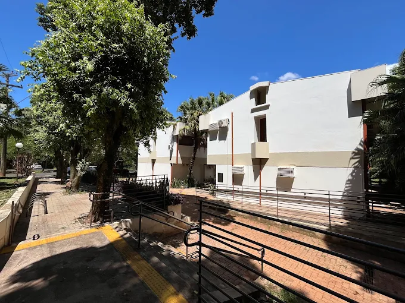

# DCCE_render
Projeto de Computação Gráfica, no qual iremos desenhar o Departamento de Ciência da Computação e Estatística do câmpus de São José do Rio Preto com OpenGL como trabalho final da disciplina.

<div align="center">
  
</div>

# Primeiro commit e modificações

Aproveitando o gancho do projeto anterior onde usamos cmake para fazer o sistema operacional vibeOS, combinamos, neste primeiro commit, a modularização proposta pelo cmake com o OpenGL para criar estruturas básicas do DCCE (ainda serão efetuadas alterações).

# Updates

Tomando como base o código de  movimentação proposto pelo Prof. Dr. Guilherme Freire, melhoramos o deslocamento pelo mundo aplicando uma lógica de arrays com duas posições para permitir o deslocamento fluído e nas diagonais. 
Além disso, consertamos a movimentação da câmera (que em versões anteriores não estava agindo como o esperado) através da implementação da sensibilidade e conversão da movimentação com radianos.

# Estruturas básicas

Para atingirmos uniformidade, utilizamos como métrica básica do mundo o cubo de 50 unidades de dimensão (50x50x50).
Essa base (literalmente a constante base) está definida em controls, junto com as variáveis de posicionamento da câmera.

# Separação dos arquivos

Na main está o loop de animação junto com as chamadas do OpenGL para atualizar os objetos do mundo.
Em mouse e keyboard estão as lógicas referentes ao deslocamento da câmera no mundo.
Separamos os componentes construídos em arquivos room e building, assim não se torna necessário a criação de uma página de código gigante, mas separa a criação de salas, cadeiras, etc. e juntaremos todas no building.

Deixei o arquivo house.c e dcce.c para referência temporária.

# Uso e instalação do cmake

Para instalar o cmake:

```bash
sudo apt update
sudo apt install cmake
cmake --version
```

Agora para executar:

```bash
1. mkdir build
2. cd /build
3. cmake ..
4. make
5. ./vibeOS
```

Lembrando que se você criou um arquivo c #Coloque na sources da CmakeLists # senão não vai funcionar!!
Também é necessário ter instalado os pacotes do freeglut para que seja possível criar um display.
